# Parte 1: Bases de Datos
*Cuando una persona acude al centro de salud, se le toma nota en una ficha con sus datos personales: nombre, fecha de nacimiento, sexo biológico y dirección (calle, número y ciudad). Esta ficha queda registrada en el archivo de pacientes del centro. Los médicos del centro también tienen su ficha, donde se registran su nombre completo, especialidad y dirección profesional. Cada vez que un médico realiza una consulta o tratamiento a un paciente, puede emitir una receta. Esta receta incluye la fecha, el nombre del paciente atendido, el médico que la emite, el medicamento o tratamiento indicado, y la enfermedad o condición que motivó la prescripción. Esta información queda registrada y organizada para facilitar tanto el seguimiento del paciente como las auditorías clínicas. Los tratamientos pueden incluir medicamentos, indicaciones como reposo o fisioterapia, y suelen tener especificaciones temporales (por ejemplo, “tomar por 5 días” o “uso indefinido”). También se registran enfermedades o diagnósticos asociados, permitiendo análisis estadísticos o seguimiento epidemiológico. El sistema busca reemplazar los registros en papel por una solución digital que permita realizar búsquedas rápidas, obtener estadísticas de distribución demográfica, sexo y especialidad, y mantener la información organizada para su integración con otros módulos médicos como historiales clínicos, turnos o recetas médicas.*

## 1.
Según su estructura esta base de datos es de tipo relacional pues ya cuenta con una estructura predefinida (presentada en la consigna) que dispone el orden fijo de cómo se asocian los datos considerados. Los mismos se acomodarán en tablas vinculadas entre sí a partir de Primary Keys (PK) y Foreign Keys (FK).
Según su función se trata de una base de datos transaccional dado que su fin es registrar y almacenar de manera digital información diaria de la gestión del centro de salud.

## 2.
Diagrama Entidad-Relación (DER), según notación de Chen:
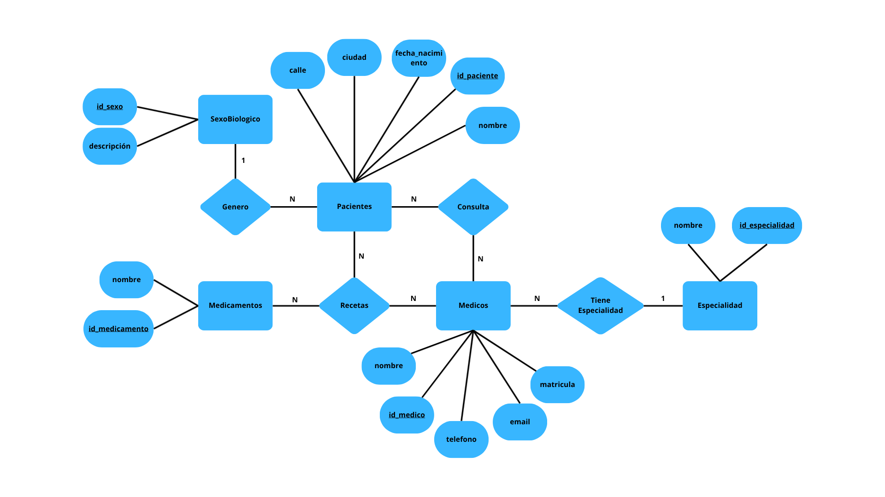
*Figura 1. DER del ejercicio presentado segun la notación de Chen.*

## 3.
Mapeo del Modelo Relacional, según notación de Crow:
El siguiente código fue utilizado en https://dbdiagram.io/d para diagramar el modelo descripto:
```sql
// Parte 1 - TP4


Table Paciente {
  id_paciente integer [primary key]
  nombre_paciente varchar(100)
  fecha_nacimiento date
  id_sexo integer [not null] // FK 'not null' para que la relacion sea obligatoria
  num_direcc varchar(10)
  calle_direcc varchar(100)
  ciudad_direcc varchar(100)
}


Table SexoBiologico {
  id_sexo integer [primary key]
  descripcion varchar(50) unique // 1:Masculino, 2:Femenino
}
Ref: SexoBiologico.id_sexo < Paciente.id_sexo


Table Medico {
  id_medico integer [primary key]
  nombre_medico varchar(100)
  id_especialidad integer [not null] // FK
  num_direcc_m varchar(10)
  calle_direcc_m varchar(100)
  ciudad_direcc_m varchar(100)
}


Table Especialidad {
  id_especialidad integer [primary key]
  descripcion varchar(100) unique
}
Ref: Especialidad.id_especialidad < Medico.id_especialidad


Table Consulta {
  id_consulta integer [primary key]
  fecha_consulta date
  id_paciente integer [not null] // FK
  id_medico integer [not null] // FK
  diagnostico varchar // para analisis estadistico
}
Ref: Paciente.id_paciente < Consulta.id_paciente
Ref: Medico.id_medico < Consulta.id_medico
Ref: Receta.id_receta < Consulta.id_consulta // Para una receta debe haber antes una consulta, pero no necesariamente al revés


Table Receta {
  id_receta integer [primary key]
  fecha_receta date
  nombre_paciente varchar(100) [not null] // FK
  nombre_medico varchar(100) [not null] // FK
  id_tratamiento integer [not null] // FK
  enfermedad  varchar
}
Ref: Paciente.nombre_paciente < Receta.nombre_paciente
Ref: Medico.nombre_medico < Receta.nombre_medico


Table Tratamiento {
  id_tratamiento integer [primary key]
  medicamento varchar
  indicacion varchar
  esp_temporal varchar // “tomar por 5 días” o “uso indefinido”
}
Ref: Tratamiento.id_tratamiento < Receta.id_tratamiento
```

El modelo resultante:

*Figura 2. Mapeo del Modelo Relacional del ejercicio presentado.*

El de la base de datos cargada en el Campus:
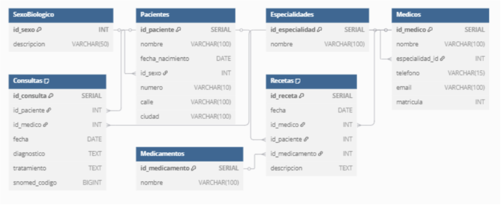
*Figura 3. Mapeo del Modelo Relacional de la base de datos provista por la cátedra.*

Luego de visualizar el mapeo de la base de datos ya cargada se concluye que la hecha manualmente siguiendo la consigna es significativamente similar a la provista.


## 4.
Para que una base de datos se encuentre normalizada debe cumplir con tres requisitos:
* 1FN (Primera Forma Normal): “cada celda de la tabla puede tener un solo valor. No se admiten json ni arreglos ni ninguna otra estructura que no sea primitiva. Todas las filas deben tener el mismo número de columnas. Tiene que haber una clave primaria para cada fila.”
* 2FN (Segunda Forma Normal): “todos los atributos deben ser totalmente dependientes de su clave primaria. No dependencias parciales.”
* 3FN (Tercera Forma Normal): deben cumplirse simultáneamente las 1FN y 2FN. “Cada columna que no sea clave debe ser independiente de las demás columnas.”
La base de datos estudiada no está completamente normalizada. Si bien en la mayoría de los casos se cumple la 1FN no ocurre en el caso, por ejemplo, de la dirección, tanto de paciente como de médico. Se podría ingresar “Ciudad Autónoma de Buenos Aires”, “CABA” o “Capital Federal”, correspondiendo las tres opciones a una misma realidad, pero pueden ser vistas como diferentes, evidenciando una falta de atomicidad o uniformidad de datos. Para corregir dicha irregularidad podría crearse una nueva tabla “Ciudades” con un id_ciudad que funciona como Primary Key y se vincule con las tablas “Paciente” y “Médico” como una Foreign Key, eliminando así posibles redundancias. Por otro lado, pareciera cumplirse el requisito 2FN en donde por ejemplo en la tabla recetas encontramos que al linkear con médicos, pacientes y medicamentos se realiza de manera correcta mediante Foreign Keys.


# Parte 2: SQL
## 1. Cuando se realizan consultas sobre la tabla paciente agrupando por ciudad los tiempos de respuesta son demasiado largos. Proponer mediante una query SQL una solución a este problema.
```sql
SELECT ciudad, COUNT(*)
FROM Pacientes
GROUP BY ciudad;
```
Salida:
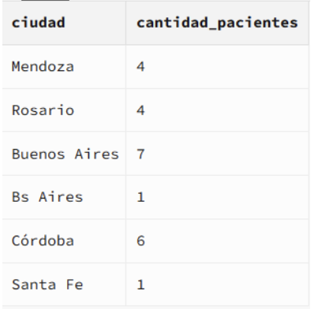

Es correcto que sumen 23 (cantidad de pacientes registrados).

## 2. Se tiene la fecha de nacimiento de los pacientes. Se desea calcular la edad de los pacientes y almacenarla de forma dinámica en el sistema ya que es un valor típicamente consultado, junto con otra información relevante del paciente.
```sql
CREATE TABLE Edades_Pacientes AS
SELECT 
    id_paciente,
    nombre,
    fecha_nacimiento,
    CAST((CURRENT_DATE::date - fecha_nacimiento::date) / 365.25 AS INT) AS edad
FROM
    Pacientes;

SELECT * FROM Edades_Pacientes
```
Salida:
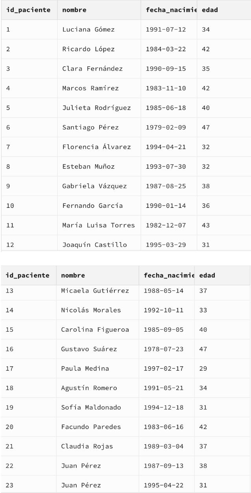

## 3. La paciente, “Luciana Gómez”, ha cambiado de dirección. Antes vivía en “Avenida Las Heras 121” en “Buenos Aires”, pero ahora vive en “Calle Corrientes 500” en “Buenos Aires”. Actualizar la dirección de este paciente en la base de datos.
```sql
UPDATE Pacientes
SET 
    calle = 'Calle Corrientes',
    numero = '500',
    ciudad = 'Buenos Aires'
WHERE nombre = 'Luciana Gómez';

SELECT nombre, numero, calle, ciudad
FROM Pacientes
WHERE nombre = 'Luciana Gómez';
```
Salida:


## 4. Seleccionar el nombre y la matrícula de cada médico cuya especialidad sea identificada por el id 4.
```sql
SELECT nombre, matricula
FROM Medicos
WHERE especialidad_id = 4;
``` 
Salida:
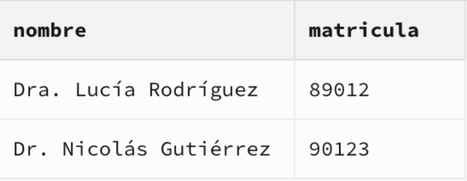

## 5. Puede pasar que haya inconsistencias en la forma en la que están escritos los nombres de las ciudades, ¿cómo se corrige esto? Agregar la query correspondiente.
```sql
UPDATE Pacientes
SET ciudad = 'Buenos Aires'
WHERE ciudad IN ('Bs Aires', 'Buenos Aires ', 'Buenos Aires', 'Bs As', 'buenos aires', 'Buenos aires', 'Buenos Aiers');

UPDATE Pacientes
SET ciudad = 'Córdoba'
WHERE ciudad IN ('Cordoba', 'Córdoba', 'Córodba');

UPDATE Pacientes
SET ciudad = 'Mendoza'
WHERE ciudad IN ('Mendoza', 'Mendzoa');

UPDATE Pacientes
SET ciudad = 'Santa Fe'
WHERE ciudad IN ('Santa Fe', 'Santa fe', 'Santa Fé', 'Santa fé');

SELECT DISTINCT ciudad FROM Pacientes;
``` 
Salida:
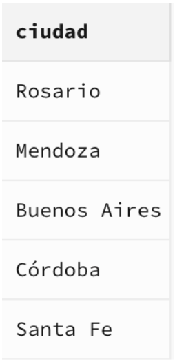

## 6. Obtener el nombre y la dirección de los pacientes que viven en Buenos Aires.
```sql
SELECT nombre, numero, calle, ciudad
FROM Pacientes
WHERE ciudad = 'Buenos Aires';
``` 
Salida:
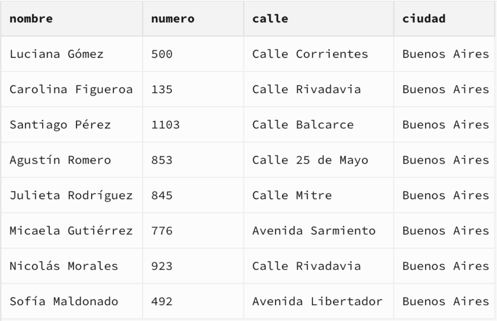

## 7. Cantidad de pacientes que viven en cada ciudad.
Nuevamente el mismo query que en el punto 1:
```sql
SELECT ciudad, COUNT(*)
FROM Pacientes
GROUP BY ciudad;
``` 
Salida:
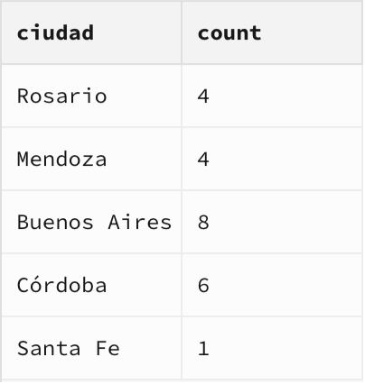

Nuevamente, suman 23.


## 8. Cantidad de pacientes por sexo que viven en cada ciudad.
```sql
SELECT 
    p.ciudad,
    SUM(CASE WHEN s.descripcion = 'Masculino' THEN 1 ELSE 0 END) AS Q_Masculino,
    SUM(CASE WHEN s.descripcion = 'Femenino' THEN 1 ELSE 0 END) AS Q_Femenino

FROM Pacientes p 
JOIN SexoBiologico s 
    ON s.id_sexo = p.id_sexo
GROUP BY p.ciudad
``` 
Salida:
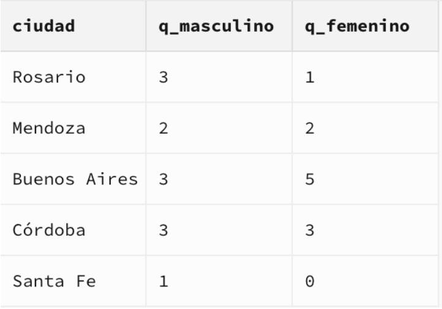

## 9. Obtener la cantidad de recetas emitidas por cada médico.
```sql
SELECT 
    m.id_medico,
    m.nombre AS medico,
    COUNT(r.id_receta) AS total_recetas
FROM Medicos m
LEFT JOIN Recetas r ON m.id_medico = r.id_medico
GROUP BY m.id_medico, m.nombre
ORDER BY total_recetas DESC;
``` 
Salida:
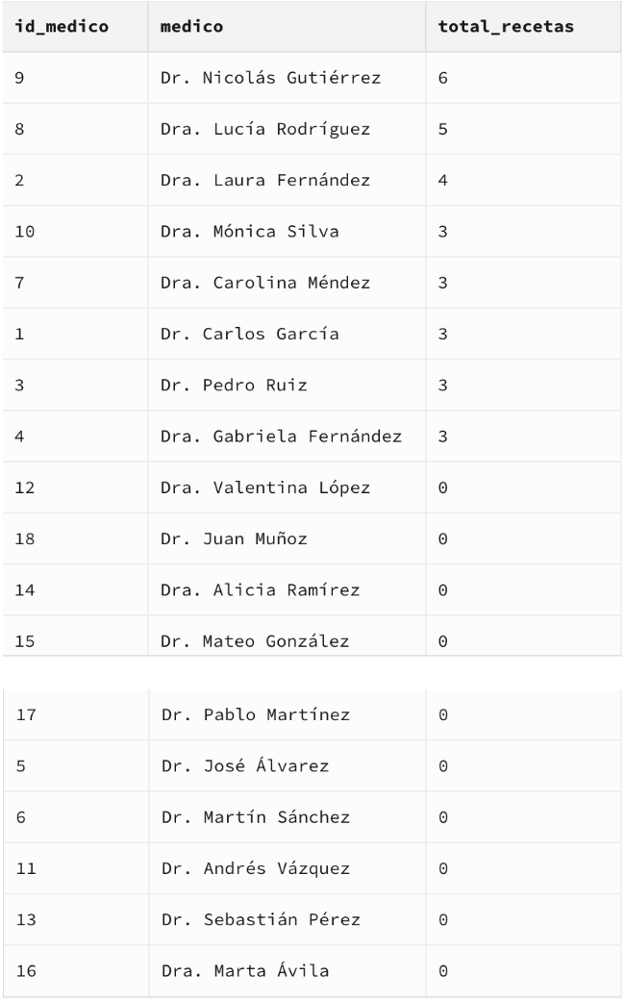

## 10. Obtener todas las consultas médicas realizadas por el médico con ID igual a 3 durante el mes de agosto de 2024.
```sql
SELECT 
    c.id_consulta,
    c.fecha,
    p.nombre AS paciente,
    c.diagnostico,
    c.tratamiento,
    c.snomed_codigo
FROM Consultas c 
JOIN Pacientes p ON c.id_paciente = p.id_paciente
WHERE 
    c.id_medico = 3
    AND c.fecha BETWEEN '2024-08-01' AND '2024-08-31'
``` 
Salida:
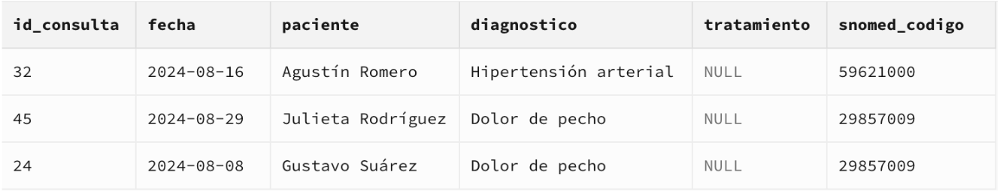

## 11. Obtener el nombre de los pacientes junto con la fecha y el diagnóstico de todas las consultas médicas realizadas en agosto del 2024.
```sql
SELECT 
    p.nombre AS paciente,
    c.fecha,
    c.diagnostico
FROM Consultas c
JOIN Pacientes p ON c.id_paciente = p.id_paciente
WHERE c.fecha BETWEEN '2024-08-01' AND '2024-08-31'
``` 
Salida:
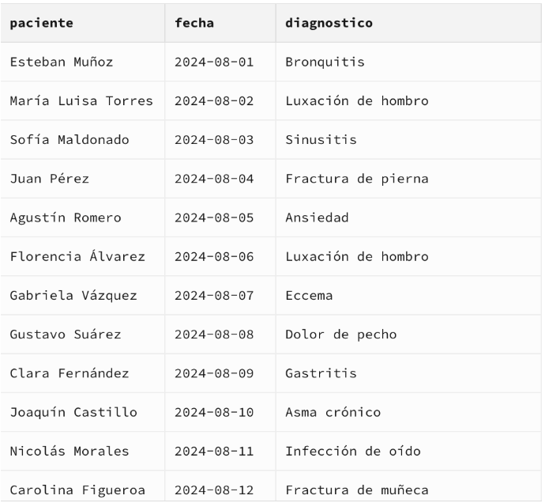
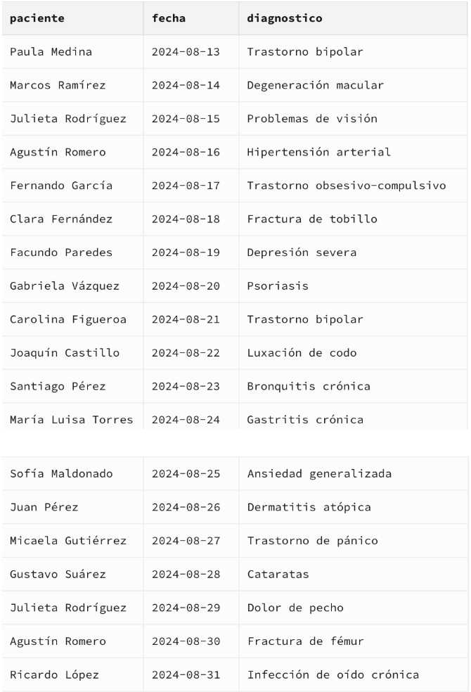

## 12. Obtener el nombre de los medicamentos prescritos más de una vez por el médico con ID igual a 2.
```sql
SELECT 
    m.nombre AS medicamento,
    COUNT(*) AS veces_recetado
FROM Recetas r
JOIN Medicamentos m ON r.id_medicamento = m.id_medicamento
WHERE r.id_medico = 2
GROUP BY m.nombre
HAVING COUNT(*) > 1;
``` 
Salida:
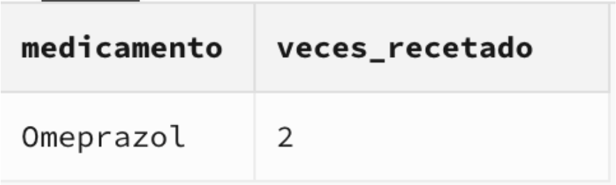

## 13. Obtener el nombre de los pacientes junto con la cantidad total de recetas que han recibido.
```sql
SELECT 
    p.id_paciente,
    p.nombre AS paciente,
    COUNT(r.id_receta) AS total_recetas
FROM Pacientes p
LEFT JOIN Recetas r ON p.id_paciente = r.id_paciente
GROUP BY p.id_paciente, p.nombre
ORDER BY p.id_paciente ASC;
``` 
Salida:
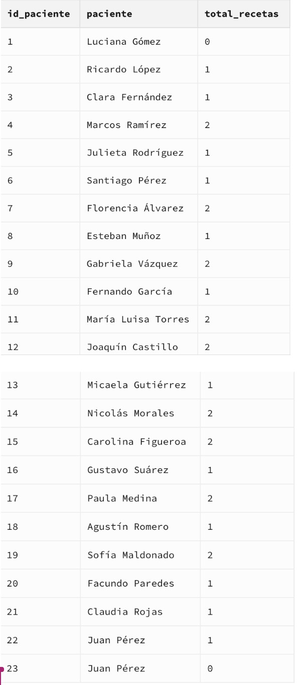

## 14. Obtener el nombre del medicamento más recetado junto con la cantidad de recetas emitidas para ese medicamento.
```sql
SELECT 
    m.nombre AS medicamento,
    COUNT(r.id_medicamento) AS total_medic
FROM Recetas r
JOIN Medicamentos m ON r.id_medicamento = m.id_medicamento
GROUP BY m.id_medicamento, m.nombre
ORDER BY total_medic DESC LIMIT 1;
``` 
Salida:
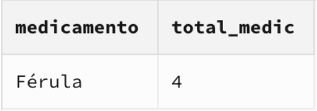

## 15. Obtener el nombre del paciente junto con la fecha de su última consulta y el diagnóstico asociado.
```sql
SELECT 
    p.id_paciente,
    p.nombre AS paciente,
    c.fecha AS ultima_consulta,
    c.diagnostico
FROM Pacientes p
JOIN Consultas c 
    ON p.id_paciente = c.id_paciente
WHERE c.fecha = (
    SELECT MAX(c2.fecha)
    FROM Consultas c2
    WHERE c2.id_paciente = p.id_paciente
)
ORDER BY p.id_paciente;
``` 
Salida:
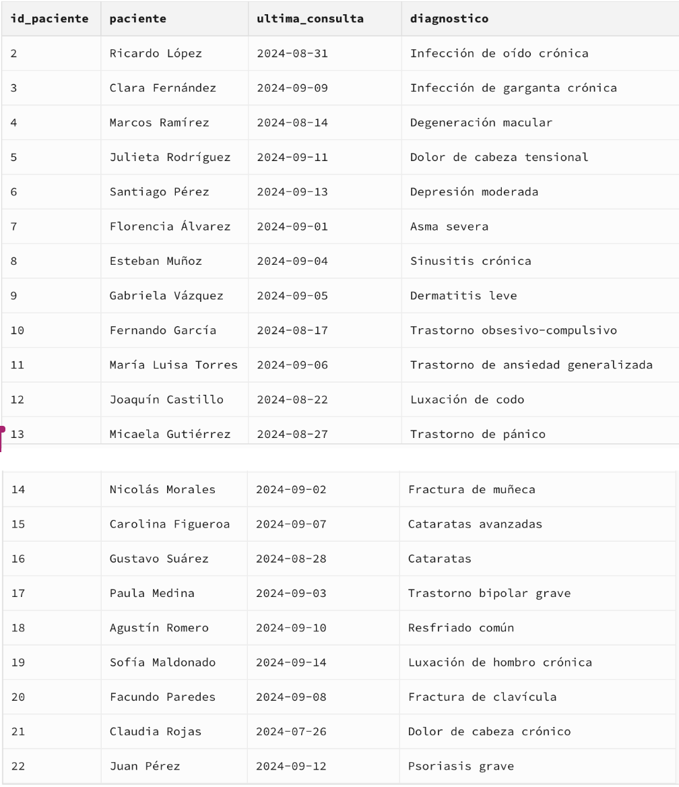

## 16. Obtener el nombre del médico junto con el nombre del paciente y el número total de consultas realizadas por cada médico para cada paciente, ordenado por médico y paciente.
```sql
SELECT 
  C.id_paciente,
  P.nombre AS nombre_paciente,
  C.id_medico,
  M.nombre AS nombre_medico,
  --C.fecha,
  --C.diagnostico
  COUNT(*) AS cantidad_consultas

FROM Consultas C

JOIN Medicos M
  ON M.id_medico = C.id_medico

JOIN Pacientes P
  ON P.id_paciente = C.id_paciente

GROUP BY 1, 2, 3, 4

ORDER BY C.id_medico ASC, C.id_paciente ASC;
``` 
Salida:
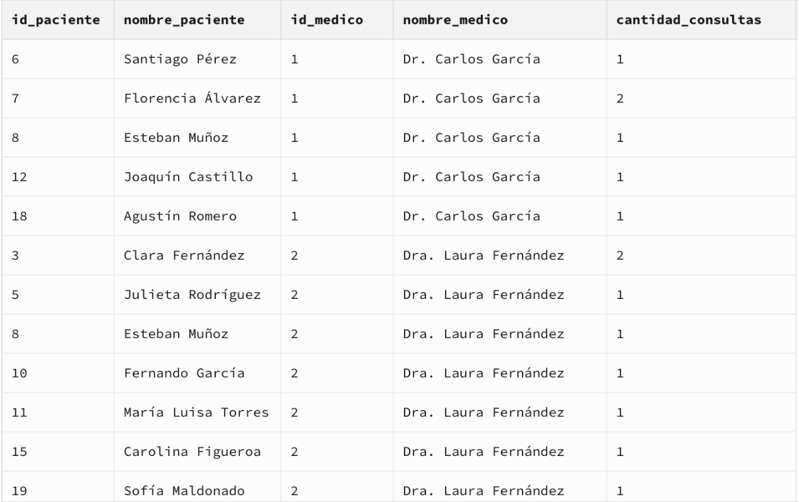

Nos parece innecesario mostrar las 53 filas de salida y por lo tanto mostramos estas primeras filas como salida representativa.


## 17. Obtener el nombre del medicamento junto con el total de recetas prescritas para ese medicamento, el nombre del médico que lo recetó y el nombre del paciente al que se le recetó, ordenado por total de recetas en orden descendente.
```sql
SELECT 
  R.id_medico,
  M.nombre AS nombre_medico,
  R.id_paciente,
  P.nombre AS nombre_paciente,
  R.id_medicamento,
  F.nombre AS nombre_medicamento,
  COUNT(*) AS cantidad_recetas

FROM Recetas R

JOIN Medicos M 
  ON M.id_medico = R.id_medico

JOIN Pacientes P 
  ON P.id_paciente = R.id_paciente

JOIN Medicamentos F 
  ON F.id_medicamento = R.id_medicamento

GROUP BY 1, 2, 3, 4, 5, 6
ORDER BY cantidad_recetas DESC;
``` 
Salida:
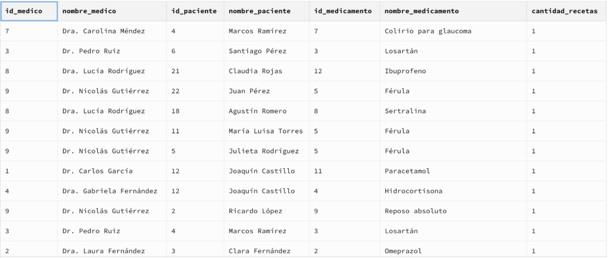

Al igual que en el ejercicio anterior nos parece innecesario mostrar la salida de las 30 filas.


## 18. Obtener el nombre del médico junto con el total de pacientes a los que ha atendido, ordenado por el total de pacientes en orden descendente.
```sql
SELECT
    m.nombre AS medico,
    COUNT(DISTINCT c.id_paciente) AS total_pacientes
FROM Medicos m
LEFT JOIN Consultas c ON m.id_medico = c.id_medico
GROUP BY m.id_medico, m.nombre
ORDER BY total_pacientes DESC;
``` 
Salida:
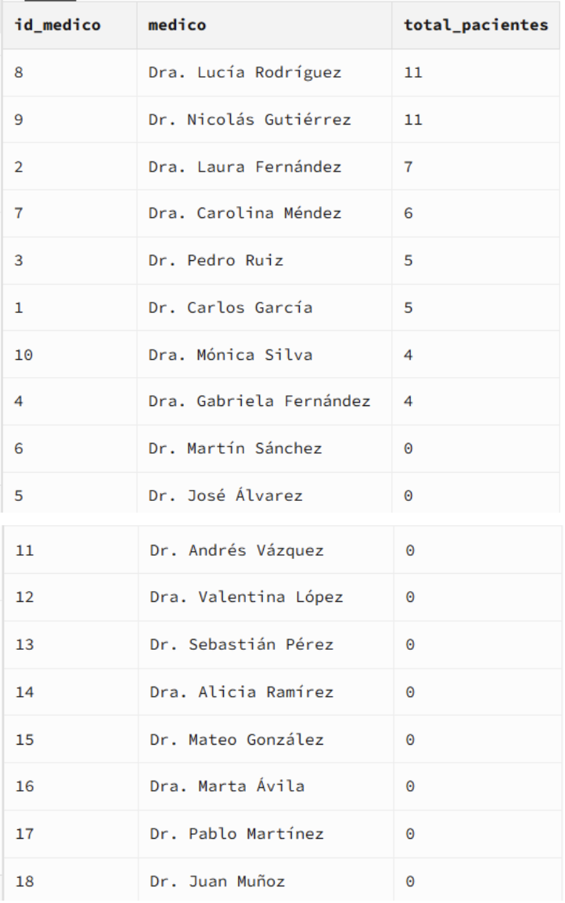
