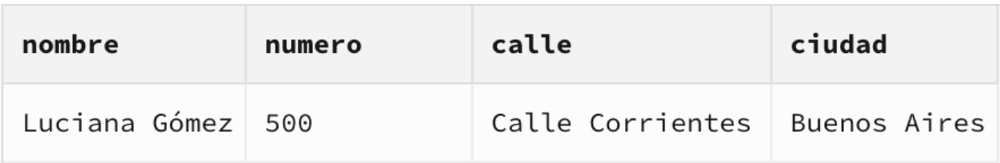

# Parte 1: Bases de Datos
*Cuando una persona acude al centro de salud, se le toma nota en una ficha con sus datos personales: nombre, fecha de nacimiento, sexo biológico y dirección (calle, número y ciudad). Esta ficha queda registrada en el archivo de pacientes del centro. Los médicos del centro también tienen su ficha, donde se registran su nombre completo, especialidad y dirección profesional. Cada vez que un médico realiza una consulta o tratamiento a un paciente, puede emitir una receta. Esta receta incluye la fecha, el nombre del paciente atendido, el médico que la emite, el medicamento o tratamiento indicado, y la enfermedad o condición que motivó la prescripción. Esta información queda registrada y organizada para facilitar tanto el seguimiento del paciente como las auditorías clínicas. Los tratamientos pueden incluir medicamentos, indicaciones como reposo o fisioterapia, y suelen tener especificaciones temporales (por ejemplo, “tomar por 5 días” o “uso indefinido”). También se registran enfermedades o diagnósticos asociados, permitiendo análisis estadísticos o seguimiento epidemiológico. El sistema busca reemplazar los registros en papel por una solución digital que permita realizar búsquedas rápidas, obtener estadísticas de distribución demográfica, sexo y especialidad, y mantener la información organizada para su integración con otros módulos médicos como historiales clínicos, turnos o recetas médicas.*


# Parte 2: SQL
## 1. Cuando se realizan consultas sobre la tabla paciente agrupando por ciudad los tiempos de respuesta son demasiado largos. Proponer mediante una query SQL una solución a este problema.
```sql
SELECT ciudad, COUNT(*)
FROM Pacientes
GROUP BY ciudad;
```
Salida:


Es correcto que sumen 23 (cantidad de pacientes registrados).

## 2. Se tiene la fecha de nacimiento de los pacientes. Se desea calcular la edad de los pacientes y almacenarla de forma dinámica en el sistema ya que es un valor típicamente consultado, junto con otra información relevante del paciente.
```sql
CREATE TABLE Edades_Pacientes AS
SELECT 
    id_paciente,
    nombre,
    fecha_nacimiento,
    CAST((CURRENT_DATE::date - fecha_nacimiento::date) / 365.25 AS INT) AS edad
FROM
    Pacientes;

SELECT * FROM Edades_Pacientes
```
Salida:


## 3. La paciente, “Luciana Gómez”, ha cambiado de dirección. Antes vivía en “Avenida Las Heras 121” en “Buenos Aires”, pero ahora vive en “Calle Corrientes 500” en “Buenos Aires”. Actualizar la dirección de este paciente en la base de datos.
```sql
UPDATE Pacientes
SET 
    calle = 'Calle Corrientes',
    numero = '500',
    ciudad = 'Buenos Aires'
WHERE nombre = 'Luciana Gómez';

SELECT nombre, numero, calle, ciudad
FROM Pacientes
WHERE nombre = 'Luciana Gómez';
```
Salida:


## 4. Seleccionar el nombre y la matrícula de cada médico cuya especialidad sea identificada por el id 4.
```sql
SELECT nombre, matricula
FROM Medicos
WHERE especialidad_id = 4;
``` 
Salida:


## 5. Puede pasar que haya inconsistencias en la forma en la que están escritos los nombres de las ciudades, ¿cómo se corrige esto? Agregar la query correspondiente.
```sql
UPDATE Pacientes
SET ciudad = 'Buenos Aires'
WHERE ciudad IN ('Bs Aires', 'Buenos Aires ', 'Buenos Aires', 'Bs As', 'buenos aires', 'Buenos aires', 'Buenos Aiers');

UPDATE Pacientes
SET ciudad = 'Córdoba'
WHERE ciudad IN ('Cordoba', 'Córdoba', 'Córodba');

UPDATE Pacientes
SET ciudad = 'Mendoza'
WHERE ciudad IN ('Mendoza', 'Mendzoa');

UPDATE Pacientes
SET ciudad = 'Santa Fe'
WHERE ciudad IN ('Santa Fe', 'Santa fe', 'Santa Fé', 'Santa fé');

SELECT DISTINCT ciudad FROM Pacientes;
``` 
Salida:


## 6. Obtener el nombre y la dirección de los pacientes que viven en Buenos Aires.
```sql
SELECT nombre, numero, calle, ciudad
FROM Pacientes
WHERE ciudad = 'Buenos Aires';
``` 
Salida:


## 7. Cantidad de pacientes que viven en cada ciudad.
Nuevamente el mismo query que en el punto 1:
```sql
SELECT ciudad, COUNT(*)
FROM Pacientes
GROUP BY ciudad;
``` 
Salida:


Nuevamente, suman 23.


## 8. Cantidad de pacientes por sexo que viven en cada ciudad.
```sql
SELECT 
    p.ciudad,
    SUM(CASE WHEN s.descripcion = 'Masculino' THEN 1 ELSE 0 END) AS Q_Masculino,
    SUM(CASE WHEN s.descripcion = 'Femenino' THEN 1 ELSE 0 END) AS Q_Femenino

FROM Pacientes p 
JOIN SexoBiologico s 
    ON s.id_sexo = p.id_sexo
GROUP BY p.ciudad
``` 
Salida:


## 9. Obtener la cantidad de recetas emitidas por cada médico.
```sql
SELECT 
    m.id_medico,
    m.nombre AS medico,
    COUNT(r.id_receta) AS total_recetas
FROM Medicos m
LEFT JOIN Recetas r ON m.id_medico = r.id_medico
GROUP BY m.id_medico, m.nombre
ORDER BY total_recetas DESC;
``` 
Salida:


## 10. Obtener todas las consultas médicas realizadas por el médico con ID igual a 3 durante el mes de agosto de 2024.
```sql
SELECT 
    c.id_consulta,
    c.fecha,
    p.nombre AS paciente,
    c.diagnostico,
    c.tratamiento,
    c.snomed_codigo
FROM Consultas c 
JOIN Pacientes p ON c.id_paciente = p.id_paciente
WHERE 
    c.id_medico = 3
    AND c.fecha BETWEEN '2024-08-01' AND '2024-08-31'
``` 
Salida:


## 11. Obtener el nombre de los pacientes junto con la fecha y el diagnóstico de todas las consultas médicas realizadas en agosto del 2024.
```sql
SELECT 
    p.nombre AS paciente,
    c.fecha,
    c.diagnostico
FROM Consultas c
JOIN Pacientes p ON c.id_paciente = p.id_paciente
WHERE c.fecha BETWEEN '2024-08-01' AND '2024-08-31'
``` 
Salida:


## 12. Obtener el nombre de los medicamentos prescritos más de una vez por el médico con ID igual a 2.
```sql
SELECT 
    m.nombre AS medicamento,
    COUNT(*) AS veces_recetado
FROM Recetas r
JOIN Medicamentos m ON r.id_medicamento = m.id_medicamento
WHERE r.id_medico = 2
GROUP BY m.nombre
HAVING COUNT(*) > 1;
``` 
Salida:


## 13. Obtener el nombre de los pacientes junto con la cantidad total de recetas que han recibido.
```sql
SELECT 
    p.id_paciente,
    p.nombre AS paciente,
    COUNT(r.id_receta) AS total_recetas
FROM Pacientes p
LEFT JOIN Recetas r ON p.id_paciente = r.id_paciente
GROUP BY p.id_paciente, p.nombre
ORDER BY p.id_paciente ASC;
``` 
Salida:


## 14. Obtener el nombre del medicamento más recetado junto con la cantidad de recetas emitidas para ese medicamento.
```sql
SELECT 
    m.nombre AS medicamento,
    COUNT(r.id_medicamento) AS total_medic
FROM Recetas r
JOIN Medicamentos m ON r.id_medicamento = m.id_medicamento
GROUP BY m.id_medicamento, m.nombre
ORDER BY total_medic DESC LIMIT 1;
``` 
Salida:


## 15. Obtener el nombre del paciente junto con la fecha de su última consulta y el diagnóstico asociado.
```sql
SELECT 
    p.id_paciente,
    p.nombre AS paciente,
    c.fecha AS ultima_consulta,
    c.diagnostico
FROM Pacientes p
JOIN Consultas c 
    ON p.id_paciente = c.id_paciente
WHERE c.fecha = (
    SELECT MAX(c2.fecha)
    FROM Consultas c2
    WHERE c2.id_paciente = p.id_paciente
)
ORDER BY p.id_paciente;
``` 
Salida:


## 16. Obtener el nombre del médico junto con el nombre del paciente y el número total de consultas realizadas por cada médico para cada paciente, ordenado por médico y paciente.
```sql
SELECT 
  C.id_paciente,
  P.nombre AS nombre_paciente,
  C.id_medico,
  M.nombre AS nombre_medico,
  --C.fecha,
  --C.diagnostico
  COUNT(*) AS cantidad_consultas

FROM Consultas C

JOIN Medicos M
  ON M.id_medico = C.id_medico

JOIN Pacientes P
  ON P.id_paciente = C.id_paciente

GROUP BY 1, 2, 3, 4

ORDER BY C.id_medico ASC, C.id_paciente ASC;
``` 
Salida:


Nos parece innecesario mostrar las 53 filas de salida y por lo tanto mostramos estas primeras filas como salida representativa.


## 17. Obtener el nombre del medicamento junto con el total de recetas prescritas para ese medicamento, el nombre del médico que lo recetó y el nombre del paciente al que se le recetó, ordenado por total de recetas en orden descendente.
```sql
SELECT 
  R.id_medico,
  M.nombre AS nombre_medico,
  R.id_paciente,
  P.nombre AS nombre_paciente,
  R.id_medicamento,
  F.nombre AS nombre_medicamento,
  COUNT(*) AS cantidad_recetas

FROM Recetas R

JOIN Medicos M 
  ON M.id_medico = R.id_medico

JOIN Pacientes P 
  ON P.id_paciente = R.id_paciente

JOIN Medicamentos F 
  ON F.id_medicamento = R.id_medicamento

GROUP BY 1, 2, 3, 4, 5, 6
ORDER BY cantidad_recetas DESC;
``` 
Salida:


Al igual que en el ejercicio anterior nos parece innecesario mostrar la salida de las 30 filas.


## 18. Obtener el nombre del médico junto con el total de pacientes a los que ha atendido, ordenado por el total de pacientes en orden descendente.
```sql
SELECT
    m.nombre AS medico,
    COUNT(DISTINCT c.id_paciente) AS total_pacientes
FROM Medicos m
LEFT JOIN Consultas c ON m.id_medico = c.id_medico
GROUP BY m.id_medico, m.nombre
ORDER BY total_pacientes DESC;
``` 
Salida:

